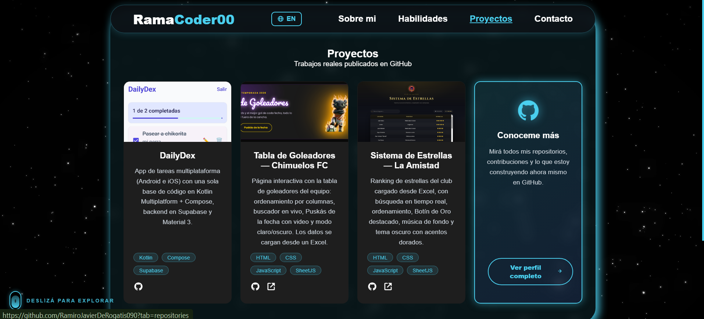

# Portafolio — RamaCoder00

Portfolio personal de **Ramiro Javier De Rogatis**, desarrollador web e ingeniero informático.

Sitio: [ramiroderogatis.com](https://ramiroderogatis.com/)

## Capturas

### Presentación

### Proyectos

## Sobre el sitio

- HTML + CSS + JavaScript puro (sin frameworks)
- Modo fullpage en desktop: una pantalla por sección con transiciones animadas
- Secciones: Sobre mí · Tech Stack · Proyectos · Contacto
- Bilingüe (ES/EN)
- Formulario de contacto con [Formspree](https://formspree.io/)

## Uso

Abrí `index.html` en el navegador o serví la carpeta con cualquier servidor estático.

## Licencia

Uso personal. Todos los proyectos mostrados son de mi autoría.
